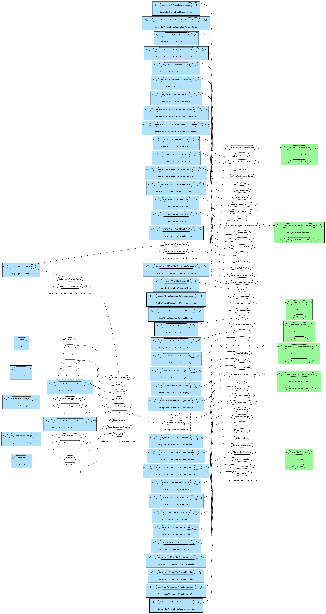

# ichorCNA

## Overview



## Dependencies

* [ichorCNA 0.2](https://github.com/broadinstitute/ichorCNA)
* [hmmcopy-utils 0.1.1](https://shahlab.ca/projects/hmmcopy_utils/)

## Usage

### Cromwell
```
java -jar cromwell.jar run ichorCNA.wdl --inputs inputs.json
```

### Inputs

#### Required workflow parameters:
Parameter|Value
---|---
ichorCNA.bam | File
ichorCNA.bamIndex | File
ichorCNA.chromosomesToAnalyze | String
ichorCNA.minimumMappingQuality | Int
ichorCNA.windowSize | Int

#### Optional workflow parameters:
Parameter|Value
---|---
ichorCNA.outputFileNamePrefix | String? (optional)

#### Optional task parameters:
Parameter|Value
---|---
ichorCNA.runIchorCNA.altFracThreshold | Float? (optional)
ichorCNA.runIchorCNA.centromere | String? (optional, default = "$ICHORCNA_ROOT/lib/R/ichorCNA/extdata/GRCh37.p13_centromere_UCSC-gapTable.txt")
ichorCNA.runIchorCNA.chrNormalize | String? (optional)
ichorCNA.runIchorCNA.chrTrain | String? (optional, default = "\"c(1:22)\"")
ichorCNA.runIchorCNA.chrs | String? (optional, default = "\"c(1:22, 'X')\"")
ichorCNA.runIchorCNA.coverage | String? (optional)
ichorCNA.runIchorCNA.estimateNormal | Boolean? (optional, default = true)
ichorCNA.runIchorCNA.estimatePloidy | Boolean? (optional, default = true)
ichorCNA.runIchorCNA.estimateScPrevalence | Boolean? (optional, default = true)
ichorCNA.runIchorCNA.exonsBed | String? (optional)
ichorCNA.runIchorCNA.fracReadsInChrYForMale | Float? (optional)
ichorCNA.runIchorCNA.gcWig | String (optional, default = "$ICHORCNA_ROOT/lib/R/ichorCNA/extdata/gc_hg19_1000kb.wig")
ichorCNA.runIchorCNA.genomeBuild | String? (optional)
ichorCNA.runIchorCNA.genomeStyle | String? (optional)
ichorCNA.runIchorCNA.includeHOMD | Boolean? (optional, default = true)
ichorCNA.runIchorCNA.lambda | String? (optional)
ichorCNA.runIchorCNA.lambdaScaleHyperParam | Int? (optional)
ichorCNA.runIchorCNA.libdir | String? (optional)
ichorCNA.runIchorCNA.mapWig | String? (optional, default = "$ICHORCNA_ROOT/lib/R/ichorCNA/extdata/map_hg19_1000kb.wig")
ichorCNA.runIchorCNA.maxCN | Int? (optional, default = 5)
ichorCNA.runIchorCNA.maxFracCNASubclone | Float? (optional)
ichorCNA.runIchorCNA.maxFracGenomeSubclone | Float? (optional)
ichorCNA.runIchorCNA.mem | Int? (optional, default = 8)
ichorCNA.runIchorCNA.minMapScore | Float? (optional)
ichorCNA.runIchorCNA.minSegmentBins | String? (optional)
ichorCNA.runIchorCNA.modules | String? (optional, default = "ichorcna/0.2")
ichorCNA.runIchorCNA.normal | String (optional, default = "\"c(0.2, 0.3, 0.4, 0.5, 0.6, 0.7, 0.8, 0.9)\"")
ichorCNA.runIchorCNA.normalPanel | String? (optional, default = "$ICHORCNA_ROOT/lib/R/ichorCNA/extdata/HD_ULP_PoN_1Mb_median_normAutosome_mapScoreFiltered_median.rds")
ichorCNA.runIchorCNA.normalWig | File? (optional)
ichorCNA.runIchorCNA.normalizeMaleX | Boolean? (optional)
ichorCNA.runIchorCNA.outDir | String? (optional, default = "./")
ichorCNA.runIchorCNA.ploidy | String? (optional, default = "\"c(2,3)\"")
ichorCNA.runIchorCNA.plotFileType | String? (optional)
ichorCNA.runIchorCNA.plotYLim | String? (optional)
ichorCNA.runIchorCNA.rmCentromereFlankLength | Int? (optional)
ichorCNA.runIchorCNA.scStates | String? (optional, default = "\"c(1, 3)\"")
ichorCNA.runIchorCNA.txnE | Float? (optional, default = 0.9999)
ichorCNA.runIchorCNA.txnStrength | Int? (optional, default = 10000)
ichorCNA.runReadCounter.mem | Int? (optional, default = 8)
ichorCNA.runReadCounter.modules | String? (optional, default = "hmmcopy-utils/0.1.1")

### Outputs

Output | Type | Description
---|---|---
`segments` | File | Segments called by the Viterbi algorithm.  Format is compatible with IGV.
`segmentsWithSubclonalStatus` | File | Same as `segments` but also includes subclonal status of segments (0=clonal, 1=subclonal). Format not compatible with IGV.
`estimatedCopyNumber` | File | Estimated copy number, log ratio, and subclone status for each bin/window.
`convergedParameters` | File | Final converged parameters for optimal solution. Also contains table of converged parameters for all solutions.
`correctedDepth` | File | Log2 ratio of each bin/window after correction for GC and mappability biases.
`rData` | File | Saved R image after ichorCNA has finished. Results for all solutions will be included.
`plots` | File | Directory of plots

See https://github.com/broadinstitute/ichorCNA/wiki/Output for more details.

## Niassa + Cromwell

This WDL workflow is wrapped in a Niassa workflow (https://github.com/oicr-gsi/pipedev/tree/master/pipedev-niassa-cromwell-workflow) so that it can used with the Niassa metadata tracking system (https://github.com/oicr-gsi/niassa).

* Building
```
mvn clean install
```

* Testing
```
mvn clean verify \
-Djava_opts="-Xmx1g -XX:+UseG1GC -XX:+UseStringDeduplication" \
-DrunTestThreads=2 \
-DskipITs=false \
-DskipRunITs=false \
-DworkingDirectory=/path/to/tmp/ \
-DschedulingHost=niassa_oozie_host \
-DwebserviceUrl=http://niassa-url:8080 \
-DwebserviceUser=niassa_user \
-DwebservicePassword=niassa_user_password \
-Dcromwell-host=http://cromwell-url:8000
```

## Support

For support, please file an issue on the [Github project](https://github.com/oicr-gsi) or send an email to gsi@oicr.on.ca .
