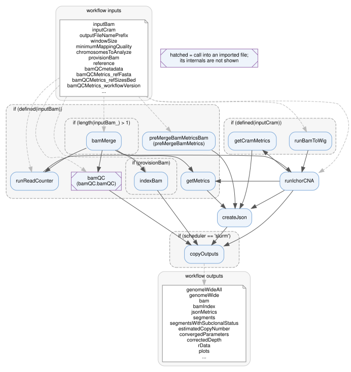

# ichorCNA

## Overview



Workflow for estimating the fraction of tumor in cell-free DNA from sWGS (shallow Whole Genome Sequencing). ichorCNA can be used to inform the presence or absence of tumor-derived DNA and to guide the decision to perform whole exome or deeper whole genome sequencing. Furthermore, the quantitative estimate of tumor fraction can we used to calibrate the desired depth of sequencing to reach statistical power for identifying mutations in cell-free DNA. Finally, ichorCNA can be use to detect large-scale copy number alterations from large cohorts by taking advantage of the cost-effective approach of ultra-low-pass sequencing.

The workflow takes either one or more bam files or a single cram file. Bam input is merged if needed, converted to a read-count WIG with HMMcopy readCounter, and QC'd with the bamQC subworkflow. Cram input (e.g. Ultima Genomics) is indexed and converted to a per-window mean coverage WIG with mosdepth; bamQC is skipped. When scheduler is slurm the final outputs are also copied to outputDirectory.

## Dependencies

* [samtools 1.14](http://www.htslib.org/)
* [hmmcopy-utils 0.1.1](https://shahlab.ca/projects/hmmcopy_utils/)
* [mosdepth 0.3.8](https://github.com/brentp/mosdepth)
* [ichorcna 0.2](https://github.com/broadinstitute/ichorCNA)
* [python 3.9](python.org)
* [pandas 1.4.2](https://pandas.pydata.org/)


## Usage

### Cromwell
```
java -jar cromwell.jar run ichorCNA.wdl --inputs inputs.json
```

### Inputs

#### Required workflow parameters:
Parameter|Value|Description
---|---|---
`outputFileNamePrefix`|String|Output prefix to prefix output file names with.
`windowSize`|Int|The size of non-overlapping windows.
`minimumMappingQuality`|Int|Mapping quality value below which reads are ignored.
`chromosomesToAnalyze`|String|Chromosomes in the bam reference file.
`provisionBam`|Boolean|Boolean, to provision out bam file and coverage metrics
`reference`|String|The genome reference build: hg19, hg38, hg38_noAlt, or hg38_ultima. Use hg38_ultima for Ultima Genomics cram input, which is decoded against the Ultima hg38 reference.


#### Optional workflow parameters:
Parameter|Value|Default|Description
---|---|---|---
`inputBam`|Array[File]?|None|Array of one or multiple bam files. Provide either inputBam or inputCram (not both). BAM input uses the readCounter wig-generation path.
`inputCram`|File?|None|Single cram file. Provide either inputBam or inputCram (not both). CRAM input uses the mosdepth wig-generation path.
`bamQCmetadata`|Map[String,String]|{}|Metadata map for bamQC. Required for bam input (bamQC runs); ignored for cram input (bamQC is skipped).
`bamQCMetrics_refFasta`|String|""|Path to genome FASTA reference for bamQC. Required for bam input; ignored for cram input.
`bamQCMetrics_refSizesBed`|String|""|Path to genome BED reference with chromosome sizes for bamQC. Required for bam input; ignored for cram input.
`bamQCMetrics_workflowVersion`|String|""|Workflow version string for bamQC. Required for bam input; ignored for cram input.
`scheduler`|String|"sge"|Batch scheduler the workflow runs under, sge or slurm. With slurm the final outputs are also copied to outputDirectory by the copyOutputs task, for deployments where Cromwell's final_workflow_outputs_dir is not available. With sge nothing is copied and outputs are provisioned by Vidarr as usual.
`outputDirectory`|String?|None|Absolute path, on a filesystem visible from the compute nodes, to copy the final workflow outputs into. Required when scheduler is slurm; ignored otherwise.


#### Optional task parameters:
Parameter|Value|Default|Description
---|---|---|---
`preMergeBamMetricsBam.refFasta`|String?|None|Reference FASTA, required when the input is cram so samtools can decode it. Default: [NULL].
`preMergeBamMetricsBam.jobMemory`|Int|8|Memory (in GB) to allocate to the job.
`preMergeBamMetricsBam.modules`|String|"samtools/1.14"|Environment module name and version to load (space separated) before command execution.
`preMergeBamMetricsBam.timeout`|Int|12|Maximum amount of time (in hours) the task can run for.
`bamMerge.jobMemory`|Int|32|Memory allocated indexing job
`bamMerge.modules`|String|"samtools/1.14"|Required environment modules
`bamMerge.timeout`|Int|72|Hours before task timeout
`indexBam.jobMemory`|Int|12|Memory (in GB) to allocate to the job.
`indexBam.modules`|String|"samtools/1.14"|Environment module name and version to load (space separated) before command execution.
`indexBam.timeout`|Int|48|Maximum amount of time (in hours) the task can run for.
`runReadCounter.mem`|Int|8|Memory (in GB) to allocate to the job.
`runReadCounter.modules`|String|"samtools/1.14 hmmcopy-utils/0.1.1"|Environment module name and version to load (space separated) before command execution.
`runReadCounter.timeout`|Int|12|Maximum amount of time (in hours) the task can run for.
`bamQC.collateResults_timeout`|Int|1|hours before task timeout
`bamQC.collateResults_threads`|Int|4|Requested CPU threads
`bamQC.collateResults_jobMemory`|Int|8|Memory allocated for this job
`bamQC.collateResults_modules`|String|"python/3.6"|required environment modules
`bamQC.cumulativeDistToHistogram_timeout`|Int|1|hours before task timeout
`bamQC.cumulativeDistToHistogram_threads`|Int|4|Requested CPU threads
`bamQC.cumulativeDistToHistogram_jobMemory`|Int|8|Memory allocated for this job
`bamQC.cumulativeDistToHistogram_modules`|String|"python/3.6"|required environment modules
`bamQC.runMosdepth_timeout`|Int|4|hours before task timeout
`bamQC.runMosdepth_threads`|Int|4|Requested CPU threads
`bamQC.runMosdepth_jobMemory`|Int|16|Memory allocated for this job
`bamQC.runMosdepth_modules`|String|"mosdepth/0.2.9"|required environment modules
`bamQC.bamQCMetrics_timeout`|Int|4|hours before task timeout
`bamQC.bamQCMetrics_threads`|Int|4|Requested CPU threads
`bamQC.bamQCMetrics_jobMemory`|Int|16|Memory allocated for this job
`bamQC.bamQCMetrics_modules`|String|"bam-qc-metrics/0.2.5"|required environment modules
`bamQC.bamQCMetrics_normalInsertMax`|Int|1500|Maximum of expected insert size range
`bamQC.markDuplicates_timeout`|Int|4|hours before task timeout
`bamQC.markDuplicates_threads`|Int|4|Requested CPU threads
`bamQC.markDuplicates_jobMemory`|Int|16|Memory allocated for this job
`bamQC.markDuplicates_modules`|String|"picard/2.21.2"|required environment modules
`bamQC.markDuplicates_picardMaxMemMb`|Int|6000|Memory requirement in MB for running Picard JAR
`bamQC.markDuplicates_opticalDuplicatePixelDistance`|Int|100|Maximum offset between optical duplicate clusters
`bamQC.downsampleRegion_timeout`|Int|4|hours before task timeout
`bamQC.downsampleRegion_threads`|Int|4|Requested CPU threads
`bamQC.downsampleRegion_jobMemory`|Int|16|Memory allocated for this job
`bamQC.downsampleRegion_modules`|String|"samtools/1.9"|required environment modules
`bamQC.downsample_timeout`|Int|4|hours before task timeout
`bamQC.downsample_threads`|Int|4|Requested CPU threads
`bamQC.downsample_jobMemory`|Int|16|Memory allocated for this job
`bamQC.downsample_modules`|String|"samtools/1.9"|required environment modules
`bamQC.downsample_randomSeed`|Int|42|Random seed for pre-downsampling (if any)
`bamQC.downsample_downsampleSuffix`|String|"downsampled.bam"|Suffix for output file
`bamQC.findDownsampleParamsMarkDup_timeout`|Int|4|hours before task timeout
`bamQC.findDownsampleParamsMarkDup_threads`|Int|4|Requested CPU threads
`bamQC.findDownsampleParamsMarkDup_jobMemory`|Int|16|Memory allocated for this job
`bamQC.findDownsampleParamsMarkDup_modules`|String|"python/3.6"|required environment modules
`bamQC.findDownsampleParamsMarkDup_customRegions`|String|""|Custom downsample regions; overrides chromosome and interval parameters
`bamQC.findDownsampleParamsMarkDup_intervalStart`|Int|100000|Start of interval in each chromosome, for very large BAMs
`bamQC.findDownsampleParamsMarkDup_baseInterval`|Int|15000|Base width of interval in each chromosome, for very large BAMs
`bamQC.findDownsampleParamsMarkDup_chromosomes`|Array[String]|["chr12", "chr13", "chrXII", "chrXIII"]|Array of chromosome identifiers for downsampled subset
`bamQC.findDownsampleParamsMarkDup_threshold`|Int|10000000|Minimum number of reads to conduct downsampling
`bamQC.findDownsampleParams_timeout`|Int|4|hours before task timeout
`bamQC.findDownsampleParams_threads`|Int|4|Requested CPU threads
`bamQC.findDownsampleParams_jobMemory`|Int|16|Memory allocated for this job
`bamQC.findDownsampleParams_modules`|String|"python/3.6"|required environment modules
`bamQC.findDownsampleParams_preDSMultiplier`|Float|1.5|Determines target size for pre-downsampled set (if any). Must have (preDSMultiplier) < (minReadsRelative).
`bamQC.findDownsampleParams_precision`|Int|8|Number of decimal places in fraction for pre-downsampling
`bamQC.findDownsampleParams_minReadsRelative`|Int|2|Minimum value of (inputReads)/(targetReads) to allow pre-downsampling
`bamQC.findDownsampleParams_minReadsAbsolute`|Int|10000|Minimum value of targetReads to allow pre-downsampling
`bamQC.findDownsampleParams_targetReads`|Int|100000|Desired number of reads in downsampled output
`bamQC.indexBamFile_timeout`|Int|4|hours before task timeout
`bamQC.indexBamFile_threads`|Int|4|Requested CPU threads
`bamQC.indexBamFile_jobMemory`|Int|16|Memory allocated for this job
`bamQC.indexBamFile_modules`|String|"samtools/1.9"|required environment modules
`bamQC.countInputReads_timeout`|Int|4|hours before task timeout
`bamQC.countInputReads_threads`|Int|4|Requested CPU threads
`bamQC.countInputReads_jobMemory`|Int|16|Memory allocated for this job
`bamQC.countInputReads_modules`|String|"samtools/1.9"|required environment modules
`bamQC.updateMetadata_timeout`|Int|4|hours before task timeout
`bamQC.updateMetadata_threads`|Int|4|Requested CPU threads
`bamQC.updateMetadata_jobMemory`|Int|16|Memory allocated for this job
`bamQC.updateMetadata_modules`|String|"python/3.6"|required environment modules
`bamQC.filter_timeout`|Int|4|hours before task timeout
`bamQC.filter_threads`|Int|4|Requested CPU threads
`bamQC.filter_jobMemory`|Int|16|Memory allocated for this job
`bamQC.filter_modules`|String|"samtools/1.9"|required environment modules
`bamQC.filter_minQuality`|Int|30|Minimum alignment quality to pass filter
`runMosdepth.threads`|Int|8|Number of threads for mosdepth.
`runMosdepth.mem`|Int|16|Memory (in GB) to allocate to the job.
`runMosdepth.modules`|String|"mosdepth/0.3.8 samtools/1.14"|Environment module name and version to load (space separated) before command execution.
`runMosdepth.timeout`|Int|12|Maximum amount of time (in hours) the task can run for.
`runIchorCNA.normalWig`|File?|None|Normal WIG file. Default: [NULL].
`runIchorCNA.exonsBed`|String?|None|Bed file containing exon regions. Default: [NULL].
`runIchorCNA.minMapScore`|Float?|None|Include bins with a minimum mappability score of this value. Default: [0.9].
`runIchorCNA.rmCentromereFlankLength`|Int?|None|Length of region flanking centromere to remove. Default: [1e+05].
`runIchorCNA.normal`|String|"\"c(0.2, 0.3, 0.4, 0.5, 0.6, 0.7, 0.8, 0.9)\""|Initial normal contamination; can be more than one value if additional normal initializations are desired. Default: [0.5]
`runIchorCNA.scStates`|String|"\"c(1, 3)\""|Subclonal states to consider.
`runIchorCNA.coverage`|String?|None|PICARD sequencing coverage.
`runIchorCNA.lambda`|String?|None|Initial Student's t precision; must contain 4 values (e.g. c(1500,1500,1500,1500)); if not provided then will automatically use based on variance of data.
`runIchorCNA.lambdaScaleHyperParam`|Int?|None|Hyperparameter (scale) for Gamma prior on Student's-t precision. Default: [3].
`runIchorCNA.ploidy`|String|"\"c(2,3)\""|Initial tumour ploidy; can be more than one value if additional ploidy initializations are desired. Default: [2]
`runIchorCNA.maxCN`|Int|5|Total clonal CN states.
`runIchorCNA.estimateNormal`|Boolean|true|Estimate normal?
`runIchorCNA.estimateScPrevalence`|Boolean|true|Estimate subclonal prevalence?
`runIchorCNA.estimatePloidy`|Boolean|true|Estimate tumour ploidy?
`runIchorCNA.maxFracCNASubclone`|Float?|None|Exclude solutions with fraction of subclonal events greater than this value. Default: [0.7].
`runIchorCNA.maxFracGenomeSubclone`|Float?|None|Exclude solutions with subclonal genome fraction greater than this value. Default: [0.5].
`runIchorCNA.minSegmentBins`|String?|None|Minimum number of bins for largest segment threshold required to estimate tumor fraction; if below this threshold, then will be assigned zero tumor fraction.
`runIchorCNA.altFracThreshold`|Float?|None|Minimum proportion of bins altered required to estimate tumor fraction; if below this threshold, then will be assigned zero tumor fraction. Default: [0.05].
`runIchorCNA.chrNormalize`|String?|None|Specify chromosomes to normalize GC/mappability biases. Default: [c(1:22)].
`runIchorCNA.chrTrain`|String|"\"c(1:22)\""|Specify chromosomes to estimate params. Default: [c(1:22)].
`runIchorCNA.genomeStyle`|String?|None|NCBI or UCSC chromosome naming convention; use UCSC if desired output is to have "chr" string. [Default: NCBI].
`runIchorCNA.normalizeMaleX`|Boolean?|None|If male, then normalize chrX by median. Default: [TRUE].
`runIchorCNA.fracReadsInChrYForMale`|Float?|None|Threshold for fraction of reads in chrY to assign as male. Default: [0.001].
`runIchorCNA.includeHOMD`|Boolean|true|If FALSE, then exclude HOMD state. Useful when using large bins (e.g. 1Mb). Default: [FALSE].
`runIchorCNA.txnE`|Float|0.9999|Self-transition probability. Increase to decrease number of segments. Default: [0.9999999]
`runIchorCNA.txnStrength`|Int|10000|Transition pseudo-counts. Exponent should be the same as the number of decimal places of --txnE. Default: [1e+07].
`runIchorCNA.plotFileType`|String?|None|File format for output plots. Default: [pdf].
`runIchorCNA.plotYLim`|String?|None|ylim to use for chromosome plots. Default: [c(-2,2)].
`runIchorCNA.outDir`|String|"./"|Output Directory. Default: [./].
`runIchorCNA.libdir`|String?|None|Script library path.
`runIchorCNA.modules`|String|"ichorcna/0.2"|Environment module name and version to load (space separated) before command execution.
`runIchorCNA.mem`|Int|8|Memory (in GB) to allocate to the job.
`runIchorCNA.timeout`|Int|12|Maximum amount of time (in hours) the task can run for.
`getMetrics.refFasta`|String?|None|Reference FASTA, required when the input is cram so samtools can decode it. Default: [NULL].
`getMetrics.jobMemory`|Int|8|Memory (in GB) to allocate to the job.
`getMetrics.modules`|String|"samtools/1.14"|Environment module name and version to load (space separated) before command execution.
`getMetrics.timeout`|Int|12|Maximum amount of time (in hours) the task can run for.
`getCramMetrics.jobMemory`|Int|8|Memory (in GB) to allocate to the job.
`getCramMetrics.modules`|String|"samtools/1.14"|Environment module name and version to load (space separated) before command execution.
`getCramMetrics.timeout`|Int|12|Maximum amount of time (in hours) the task can run for.
`createJson.jobMemory`|Int|8|Memory (in GB) to allocate to the job.
`createJson.modules`|String|"pandas/1.4.2"|Environment module name and version to load (space separated) before command execution.
`createJson.timeout`|Int|12|Maximum amount of time (in hours) the task can run for.
`copyOutputs.jobMemory`|Int|4|Memory (in GB) to allocate to the job.
`copyOutputs.timeout`|Int|4|Maximum amount of time (in hours) the task can run for.


### Outputs

Output | Type | Description | Labels
---|---|---|---
`genomeWideAll`|Pair[File,Map[String,String]]|Genome wide plots for each solution|
`genomeWide`|Pair[File,Map[String,String]]|Genome wide plots for the selected solution|
`bam`|File?|Bam file used for the analysis (merged if input is multiple bams). Bam input with provisionBam only.|vidarr_label: bam
`bamIndex`|File?|Index of the bam file used for the analysis. Bam input with provisionBam only.|vidarr_label: bamIndex
`jsonMetrics`|File|Report on coverage, read counts and ichorCNA metrics.|vidarr_label: jsonMetrics
`segments`|File|Segments called by the Viterbi algorithm.  Format is compatible with IGV.|vidarr_label: segments
`segmentsWithSubclonalStatus`|File|Same as segments but also includes subclonal status of segments (0=clonal, 1=subclonal). Format not compatible with IGV.|vidarr_label: segmentsWithSubclonalStatus
`estimatedCopyNumber`|File|Estimated copy number, log ratio, and subclone status for each bin/window.|vidarr_label: estimatedCopyNumber
`convergedParameters`|File|Final converged parameters for optimal solution. Also contains table of converged parameters for all solutions.|vidarr_label: convergedParameters
`correctedDepth`|File|Log2 ratio of each bin/window after correction for GC and mappability biases.|vidarr_label: correctedDepth
`rData`|File|Saved R image after ichorCNA has finished. Results for all solutions will be included.|vidarr_label: rData
`plots`|File|Archived directory of plots.|vidarr_label: plots
`bamQCresult`|File?|bamQC metrics for the bam file used for the analysis. Bam input only.|vidarr_label: bamQCresult
`copiedOutputsManifest`|File?|List of the paths the final outputs were copied to in outputDirectory. Scheduler slurm only.|vidarr_label: copiedOutputsManifest


## Commands
This section lists command(s) run by ichorCNA workflow

* Running ichorCNA

```
    set -euo pipefail

    mkdir -p mosdepth

    samtools index ~{cram}

    # per-window mean coverage with mosdepth
    mosdepth \
    -t ~{threads} \
    --fast-mode \
    -Q ~{minimumMappingQuality} \
    --by ~{windowSize} \
    --fasta ~{refFasta} \
    mosdepth/~{outputFileNamePrefix} \
    ~{cram}

    # convert the binned coverage to a fixedStep WIG; strip the "chr" prefix from
    # chrom names so they match the gcWig/mapWig reference WIGs (as the bam path does)
    zcat mosdepth/~{outputFileNamePrefix}.regions.bed.gz | \
    awk 'BEGIN { OFS="\t" }
    $1 ~ /^chr([1-9]|1[0-9]|2[0-2]|X|Y)$/ {
      chr = $1; start = $2; end = $3; cov = $4;
      if (NR == 1 || chr != prev_chr || start != prev_end) {
        print "fixedStep chrom=" chr " start=" (start+1) " step=" (end - start) " span=" (end - start);
      }
      print cov;
      prev_chr = chr; prev_end = end;
    }' | sed "s/chrom=chr/chrom=/" > ~{outputFileNamePrefix}.wig

    # write out chromosomes with reads for ichorCNA. mosdepth reports every
    # window of every contig, so keep only chromosomes with a non-zero window,
    # as runReadCounter does with idxstats (chr prefix already stripped above,
    # exclude Y, sort, wrap in single quotes)
    awk '/^fixedStep/ { sub(/.*chrom=/, ""); sub(/ .*/, ""); chrom = $0; next }
         $1 > 0 { seen[chrom] = 1 }
         END { for (c in seen) print c }' ~{outputFileNamePrefix}.wig \
    | grep -vw Y | sort -V | sed -e "s/\(.*\)/'\1'/" > ichorCNAchrs.txt
```
```
    set -euo pipefail

    runIchorCNA \
    --WIG ~{wig} \
    ~{"--NORMWIG " + normalWig} \
    --gcWig ~{gcWig} \
    ~{"--mapWig " + mapWig} \
    ~{"--normalPanel " + normalPanel} \
    ~{"--exons.bed " + exonsBed} \
    --id ~{outputFileNamePrefix} \
    ~{"--centromere " + centromere} \
    ~{"--minMapScore " + minMapScore} \
    ~{"--rmCentromereFlankLength " + rmCentromereFlankLength} \
    ~{"--normal " + normal} \
    ~{"--scStates " + scStates} \
    ~{"--coverage " + coverage} \
    ~{"--lambda " + lambda} \
    ~{"--lambdaScaleHyperParam " + lambdaScaleHyperParam} \
    ~{"--ploidy " + ploidy} \
    ~{"--maxCN " + maxCN} \
    ~{true="--estimateNormal True" false="--estimateNormal False" estimateNormal} \
    ~{true="--estimateScPrevalence True" false="--estimateScPrevalence  False" estimateScPrevalence} \
    ~{true="--estimatePloidy True" false="--estimatePloidy False" estimatePloidy} \
    ~{"--maxFracCNASubclone " + maxFracCNASubclone} \
    ~{"--maxFracGenomeSubclone " + maxFracGenomeSubclone} \
    ~{"--minSegmentBins " + minSegmentBins} \
    ~{"--altFracThreshold " + altFracThreshold} \
    ~{"--chrNormalize " + chrNormalize} \
    ~{"--chrTrain " + chrTrain} \
    --chrs "c(~{sep="," chrs})" \
    ~{"--genomeBuild " + genomeBuild} \
    ~{"--genomeStyle " + genomeStyle} \
    ~{true="--normalizeMaleX True" false="--normalizeMaleX False" normalizeMaleX} \
    ~{"--fracReadsInChrYForMale " + fracReadsInChrYForMale} \
    ~{true="--includeHOMD True" false="--includeHOMD False" includeHOMD} \
    ~{"--txnE " + txnE} \
    ~{"--txnStrength " + txnStrength} \
    ~{"--plotFileType " + plotFileType} \
    ~{"--plotYLim " + plotYLim} \
    ~{"--libdir " + libdir} \
    --outDir ~{outDir}

    # compress directory of plots
    tar -zcvf "~{outputFileNamePrefix}_plots.tar.gz" "~{outputFileNamePrefix}"

    #create txt file with plot full path
    ls $PWD/~{outputFileNamePrefix}/*genomeWide_all_sols.pdf > "~{outputFileNamePrefix}"_plots.txt
    ls $PWD/~{outputFileNamePrefix}/*genomeWide.pdf >> "~{outputFileNamePrefix}"_plots.txt
```
```
      set -euo pipefail
      samtools merge \
      -c \
      ~{resultMergedBam} \
      ~{sep=" " bams}
```
```
  set -euo pipefail

  echo run,read_count > ~{outputFileNamePrefix}_pre_merge_bam_metrics.csv
  for file in ~{sep=' ' bam}
  do
    run=$(samtools view ~{"--reference " + refFasta} -H "${file}" | grep '^@RG' | cut -f 2 | cut -f 2 -d ":" | cut -f 1 -d "-")
    run="${run%%$'\n'*}"   # keep only the first run name if the file has multiple @RG lines
    read_count=$(samtools stats ~{"--reference " + refFasta} "${file}" | grep ^SN | grep "raw total sequences" | cut -f 3)
    echo $run,$read_count >> ~{outputFileNamePrefix}_pre_merge_bam_metrics.csv
  done;

```
```
  set -euo pipefail
  samtools index ~{inputbam} ~{resultBai}
```
```
    set -euo pipefail

    samtools index ~{bam}

    # calculate chromosomes to analyze (with reads) from input data
    CHROMOSOMES_WITH_READS=$(samtools idxstats ~{bam} | awk '$3 > 0' - | cut -f1 | grep -Ew $(tr ',' '|' ```  '~{chromosomesToAnalyze}') | paste -s -d, -)

    # write out a chromosomes with reads for ichorCNA
    # split onto new lines (for wdl read_lines), exclude chrY, remove chr prefix, wrap in single quotes for ichorCNA
    echo "${CHROMOSOMES_WITH_READS}" | tr ',' '\n' | grep -v chrY | sed "s/chr//g" | sort -V | sed -e "s/\(.*\)/'\1'/" > ichorCNAchrs.txt

    # convert
    readCounter \
    --window ~{windowSize} \
    --quality ~{minimumMappingQuality} \
    --chromosome "${CHROMOSOMES_WITH_READS}" \
    ~{bam} | sed "s/chrom=chr/chrom=/" > ~{outputFileNamePrefix}.wig
```
```
  set -euo pipefail

  echo coverage,read_count,tumor_fraction,ploidy > ~{outputFileNamePrefix}_bam_metrics.csv
  coverage=$(samtools coverage ~{"--reference " + refFasta} ~{inputbam} | grep -P "^chr\d+\t|^chrX\t|^chrY\t" | awk '{ space += ($3-$2)+1; bases += $7*($3-$2);} END { print bases/space }')
  read_count=$(samtools stats ~{"--reference " + refFasta} ~{inputbam} | grep ^SN | grep "raw total sequences" | cut -f 3)
  tumor_fraction=$(cat ~{params} | head -n 2 | tail -n 1 | cut -f 2)
  ploidy=$(cat ~{params} | head -n 2 | tail -n 1 | cut -f 3)
  echo $coverage,$read_count,$tumor_fraction,$ploidy >> ~{outputFileNamePrefix}_bam_metrics.csv
  cat ~{params} | tail -n 17 > ~{outputFileNamePrefix}_all_sols_metrics.csv
```
```
  set -euo pipefail

  run=$(samtools view ~{"--reference " + refFasta} -H ~{cram} | grep '^@RG' | cut -f 2 | cut -f 2 -d ":" | cut -f 1 -d "-")
  run="${run%%$'\n'*}"   # keep only the first run name if the cram has multiple @RG lines
  read_count=$(samtools stats ~{"--reference " + refFasta} ~{cram} | grep ^SN | grep "raw total sequences" | cut -f 3)
  coverage=$(samtools coverage ~{"--reference " + refFasta} ~{cram} | grep -P "^chr\d+\t|^chrX\t|^chrY\t" | awk '{ space += ($3-$2)+1; bases += $7*($3-$2);} END { print bases/space }')
  tumor_fraction=$(cat ~{params} | head -n 2 | tail -n 1 | cut -f 2)
  ploidy=$(cat ~{params} | head -n 2 | tail -n 1 | cut -f 3)

  # lane-level CSV (one row for the single cram) — schema matches preMergeBamMetrics
  echo run,read_count > ~{outputFileNamePrefix}_lane_metrics.csv
  echo $run,$read_count >> ~{outputFileNamePrefix}_lane_metrics.csv

  # sample-level CSV — schema matches getMetrics
  echo coverage,read_count,tumor_fraction,ploidy > ~{outputFileNamePrefix}_bam_metrics.csv
  echo $coverage,$read_count,$tumor_fraction,$ploidy >> ~{outputFileNamePrefix}_bam_metrics.csv

  cat ~{params} | tail -n 17 > ~{outputFileNamePrefix}_all_sols_metrics.csv
```
```
    set -euo pipefail

    python3 <<CODE
    import csv, json
    import pandas as pd

    ### create json file with all metrics

    bam_metric = pd.read_csv("~{bamMetrics}")
    pre_metric = pd.read_csv("~{preBamMetrics}")
    all_sols = pd.read_csv("~{allSolsMetrics}", sep="\t")
    all_sols["tumor_fraction"] = round(1 - all_sols["n_est"],3)
    all_sols["solution"] = all_sols["init"]
    pre_metric_dict = pre_metric.to_dict('index')
    bam_metric_dict = bam_metric.to_dict('records')[0]
    with open("~{plotsFile}") as f:
      lines = f.readlines()

    #reorganize lane sequencing data
    lanes = []
    for lane in pre_metric_dict:
      lanes.append(pre_metric_dict[lane])

    #find selected solution
    selected_sol = ""
    for index, row in all_sols.iterrows():
      if round(row["tumor_fraction"],2) == round(bam_metric_dict["tumor_fraction"],2) and row["phi_est"] == bam_metric_dict["ploidy"]:
        selected_sol = row["init"]

    #selecting metrics from all solutions
    all_sols_metrics = {}
    for index, row in all_sols.iterrows():
      all_sols_metrics[row["solution"]] = {"tumor_fraction":row["tumor_fraction"],
                                           "ploidy":row["phi_est"],
                                           "loglik":row["loglik"]}

    metrics_dict = {"mean_coverage": bam_metric_dict["coverage"],
                    "total_reads": bam_metric_dict["read_count"],
                    "lanes_sequenced": len(pre_metric_dict),
                    "reads_per_lane":lanes,
                    "best_solution": selected_sol,
                    "tumor_fraction": bam_metric_dict["tumor_fraction"],
                    "ploidy": bam_metric_dict["ploidy"],
                    "solutions": all_sols_metrics}

    with open("~{outputFileNamePrefix}_metrics.json", "w") as outfile:
      json.dump(metrics_dict, outfile)

    ### create json output file for annotations
    output_list = []
    for line in lines:
      pdf_dict = {}
      line = line.strip()
      pdf_dict["left"] = line
      pdf_dict["right"] = {}
      pdf_dict["right"]["tumor_fraction"] = bam_metric_dict["tumor_fraction"]
      pdf_dict["right"]["ploidy"] = bam_metric_dict["ploidy"]
      output_list.append(pdf_dict)
    output_dict = {}
    output_dict["pdfs"] = output_list

    with open("~{outputFileNamePrefix}_outputs.json", "w") as outPdfJson:
        json.dump(output_dict, outPdfJson)

    CODE
```
```
    set -euo pipefail

    dest="~{outputDirectory}"
    if [ -z "${dest}" ]; then
      echo "outputDirectory is required when scheduler is slurm" >&2
      exit 1
    fi
    mkdir -p "${dest}"

    manifest="~{outputFileNamePrefix}_copied_outputs.txt"
    : > "${manifest}"

    for f in ~{sep=' ' files}; do
      cp -f "${f}" "${dest}/"
      echo "${dest}/$(basename "${f}")" >> "${manifest}"
    done
```

## Support

For support, please file an issue on the [Github project](https://github.com/oicr-gsi) or send an email to gsi@oicr.on.ca .

_Generated with generate-markdown-readme (https://github.com/oicr-gsi/gsi-wdl-tools/)_
